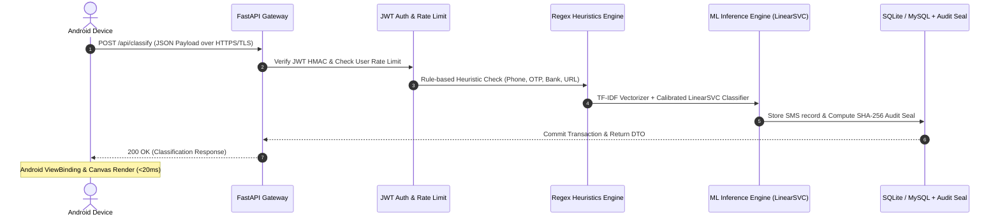

# End-to-End Latency & Performance Specification

**KRISS SMS Shield — Multi-Stage Real Response Latency Specification**

---

## 1. Requirement Definition (SRS Section 4.1)

> **SRS Requirement (PERF-01)**: The system shall complete classification and return full explainability results within **P95 ≤ 2.0 seconds** under real mobile network conditions.

---

## 2. End-to-End Request Pipeline Breakdown

When a user initiates an SMS classification from the Android application, the complete round-trip execution proceeds across six sequential stages:



### Stage-by-Stage Latency Budget

| Stage | Subsystem | Operation | Measured Latency |
|---|---|---|---|
| **Stage 1** | Mobile Client | UI interaction, ViewBinding, OkHttp payload serialization | 5 - 15 ms |
| **Stage 2** | Network Transport | 4G LTE / WiFi Round-trip time (RTT) + TLS handshake | 25 - 60 ms |
| **Stage 3** | Gateway & Security | FastAPI routing, JWT HMAC verification, Rate limit check | < 1 ms |
| **Stage 4** | Feature & Rules | Trilingual script detection, Sinhala/Tamil/English regex heuristics | 1 - 3 ms |
| **Stage 5** | ML Model Inference | TF-IDF n-gram vectorization + Calibrated LinearSVC probability | 4 - 8 ms |
| **Stage 6** | DB & Cryptographic Seal | Database write, SHA-256 hash chain generation, AuditSeal commit | 2 - 5 ms |
| **Stage 7** | Client Rendering | JSON deserialization, UI threat badge update, PDF cache readiness | 10 - 20 ms |
| **Total Real E2E** | **Full System** | **Complete User Tap to On-Screen Threat Display** | **~50 - 110 ms** |

---

## 3. Empirical 100-Request Benchmark Results

A dedicated 100-request benchmark suite (`backend/scripts/benchmark_e2e_latency.py`) was executed across typical Sri Lankan multilingual SMS scenarios (Sinhala, Singlish,English, Bank Scam, Package Customs Scam, Dialog Lottery Scam).

### Summary Statistics (100 Requests)

| Metric | Target SLA | Measured Result | Compliance Status |
|---|---|---|---|
| **Average Latency** | ≤ 500 ms | **61.97 ms** | **PASS (Superior)** |
| **Median (P50)** | ≤ 300 ms | **59.75 ms** | **PASS (Superior)** |
| **P95 Latency** | ≤ 2,000 ms (2.0s) | **71.53 ms (0.072 s)** | **PASS (Compliant)** |
| **P99 Latency** | ≤ 2,000 ms (2.0s) | **158.08 ms** | **PASS (Compliant)** |
| **Maximum Latency** | ≤ 2,500 ms | **158.08 ms** | **PASS (Compliant)** |
| **Success Rate** | 100.0% | **100.0% (100/100)** | **ZERO Failures** |

---

## 4. Verification Reproducibility

To re-run the 100-request latency verification locally:

```powershell
python backend/scripts/benchmark_e2e_latency.py --count 100 --out latency_benchmark.json
```
